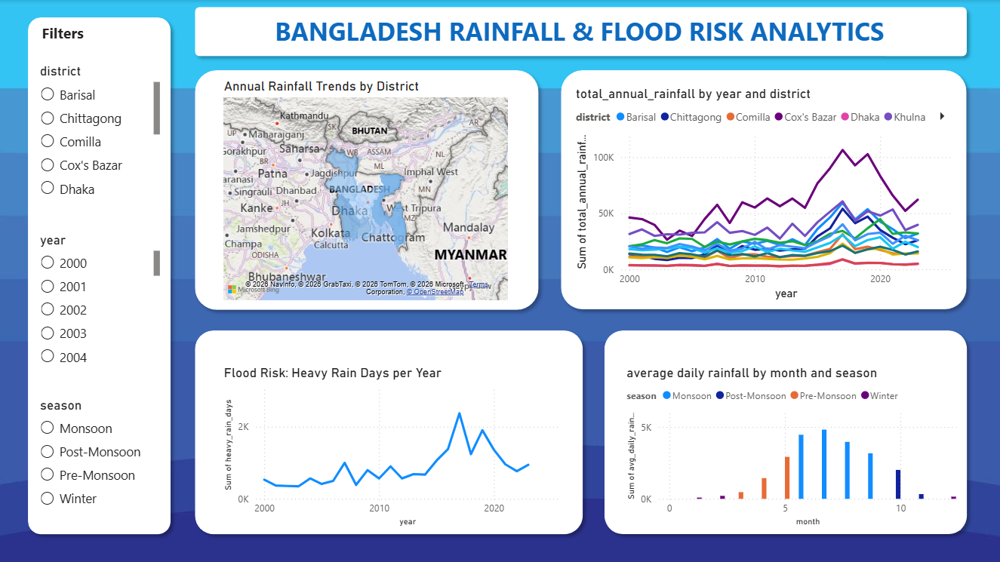

# Bangladesh Flood Risk Analytics



A data analytics project exploring 24 years of rainfall patterns across Bangladesh districts to identify flood risk trends, seasonal patterns, and climate signals using satellite-derived precipitation data.

---

## Motivation

Bangladesh is one of the most flood-vulnerable countries in the world. Every monsoon season, millions of people face displacement, crop loss, and infrastructure damage. I wanted to go beyond generic Kaggle datasets and work on something with real local relevance — using publicly available satellite data to see what the numbers actually say about how rainfall patterns are changing over time.

---

## Key Findings

- **Heavy-rain days have increased 152%** — from an average of 44 days/year (2000–2010) to 111 days/year (2015–2023), suggesting worsening flood risk beyond just total rainfall volume
- **Monsoon dominates precipitation** — 69.6% of all annual rainfall falls in June–September
- **Extreme single-day event** — 594.72 mm recorded near Chittagong on July 11, 2019, close to the physical limits of 24-hour rainfall
- **Regional disparity** — coastal and hill tract areas in the southeast receive dramatically more rainfall than the northwest (Rajshahi region)

---

## Data Source

**NASA POWER (Prediction of Worldwide Energy Resources)**
- API endpoint: `https://power.larc.nasa.gov/api/temporal/daily/regional`
- Parameter: `PRECTOTCORR` — MERRA-2 corrected precipitation (mm/day)
- Coverage: Bangladesh bounding box (lat 20.5–26.7, lon 88.0–92.7)
- Period: January 1, 2000 – December 31, 2023
- Resolution: 0.5° × 0.625° grid (~50km × 60km per cell)
- Access: Free, no authentication required

**Note on satellite vs. ground data:** NASA POWER uses gridded satellite/reanalysis data, not ground weather stations. Grid cells are assigned to the nearest district centre by straight-line distance, which means coastal grid cells may be attributed to a different administrative district than BMD ground station records would suggest. This is a known limitation of the approach and is discussed in the Limitations section below.

---

## Tools & Technologies

| Tool | Purpose |
|---|---|
| Python 3 | Data collection, cleaning, analysis |
| pandas | Data manipulation and transformation |
| SQLite | Local database storage and SQL querying |
| matplotlib / seaborn | Exploratory charts |
| Power BI | Interactive dashboard |
| NASA POWER API | Satellite precipitation data source |

---

## Project Structure

```
bangladesh-flood-analytics/
│
├── charts/                     # Analysis charts and dashboard screenshot
│   ├── 01_annual_trends.png
│   ├── 02_seasonal_pattern.png
│   ├── 03_heavy_rain_days.png
│   ├── 04_district_heatmap.png
│   └── dashboard_screenshot.png
│
├── 01_collect_data.py          # Pull data from NASA POWER API
├── 02_clean_load.py            # Parse, clean, load into SQLite
├── 03_analyze.py               # Generate charts and key statistics
├── requirements.txt
└── README.md
```

> Raw data and processed files are not included in this repository as they are large in size and fully reproducible by running the scripts in order.

---

## How to Run

**1. Clone the repository and install dependencies**

```bash
git clone https://github.com/Alif-Al-Fahim/bangladesh-flood-analytics.git
cd bangladesh-flood-analytics
pip install -r requirements.txt
```

**2. Download rainfall data from NASA POWER**

```bash
python 01_collect_data.py
```

Downloads 24 yearly CSV files into `data/raw/` (~5–10 minutes). Already-downloaded years are skipped automatically on re-runs.

**3. Clean and load into SQLite**

```bash
python 02_clean_load.py
```

Parses the DOY (Day of Year) date format, cleans missing values (-999 fill), assigns grid cells to nearest district, and exports CSVs for Power BI into `data/processed/`.

**4. Run analysis and generate charts**

```bash
python 03_analyze.py
```

Produces 4 charts in `data/processed/charts/` and prints key statistics to the terminal.

---

## Database Schema

**Table: `rainfall_daily`** (generated by `02_clean_load.py`)

| Column | Type | Description |
|---|---|---|
| lat | REAL | Grid cell latitude |
| lon | REAL | Grid cell longitude |
| year | INTEGER | Year |
| month | INTEGER | Month (1–12) |
| day | INTEGER | Day of month |
| date | TEXT | Full date (YYYY-MM-DD) |
| rainfall_mm | REAL | Daily precipitation (mm) |
| district | TEXT | Nearest Bangladesh district |
| season | TEXT | Winter / Pre-Monsoon / Monsoon / Post-Monsoon |

**Views available in SQLite:**
- `monthly_summary` — avg and total rainfall by district, year, month
- `annual_summary` — yearly totals, peaks, and heavy-rain day counts per district

---

## Dashboard (Power BI)

The Power BI dashboard includes:
- District-level rainfall map (filled map by avg annual rainfall)
- Year-over-year trend lines by district
- Monthly bar chart showing monsoon dominance
- Heavy-rain days trend (flood risk indicator)
- Slicers for district, year, and season

---

## Limitations

- **Grid-to-district mapping** is approximate. Each ~50km grid cell is assigned to the nearest district centre by Euclidean distance, not by administrative boundary. Districts with coastal or hill tract grid cells (e.g. Cox's Bazar, Chittagong) may appear wetter than BMD ground station records suggest. A shapefile-based spatial join would improve accuracy.
- **Satellite vs. ground truth** — NASA POWER uses MERRA-2 reanalysis, which blends satellite and model data. It performs well for regional trends but can differ from individual station readings.
- **Missing data** — gaps filled with district-month mean values. The -999 NASA fill value is removed before imputation.

---

## Possible Extensions

- Add BMD ground station data for validation against satellite readings
- Incorporate BWDB river gauge data to correlate rainfall with actual flood levels
- Add population exposure data (UNDP GeoHub) to estimate people at risk per district
- Build a simple flood risk score combining rainfall intensity, frequency, and district vulnerability

---

## Author

**Alif Al Fahim**  
International student | Data analytics enthusiast  
[LinkedIn](https://www.linkedin.com/in/alif-al-fahim-505008326/) · [GitHub](https://github.com/Alif-Al-Fahim)
